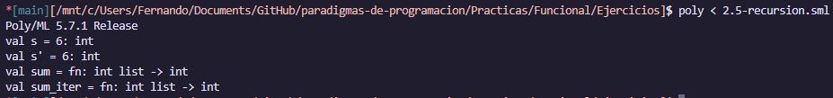
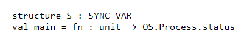

# Reporte Paradigma Funcional

-   **Clase:** Paradigmas de Programación
-   **Alumno:** Fernando Haro Calvo

## Instrucciones

Seguir las instrucciones del tour de SML (https://saityi.github.io/sml-tour/tour/welcome).
Guardar los programas que se van haciendo en cada paso en un folder del repositorio. Se
presentará evidencia de que se pueden ejecutar.

## Instrucciones de uso PolyML

Para compilar y ejecutar los programas del lenguaje SML (Standard ML) se puede utilizar el interprete `polyml`, que se puede instalar en sistemas basados en Unix con el siguiente comando:

-   Debian/Ubuntu

```bash
sudo apt-get install polyml
```

-   Arch

```bash
sudo pacman -S polyml
```

### Ejecución de programas

Con el interprete `polyml` instalado, se puede ejecutar un programa de SML de la siguiente manera:

```bash
poly < <archivo.sml>
```

Alternativamente se puede abrir el interprete y cargar el archivo con el comando `use "<archivo.sml>";`.

## Ejercicios

### 1.1 Values

```sml
val i = 10
val j : real = 10.0
val k = i

val i' = i + 1

val _ = i + 1

val _ = print "Hello!\n"

val i = 10

val iEqK = i = k (* true *)
```


### 1.1 Let expressions

```sml
val lexpr =
  let val x = 1
      val y = 2
  in x + y
  end
```


### 1.2 Basic data types

```sml
val u : unit = ()

val b : bool = true

val i : int = 1

val iNegative = ~1

val r : real = 2.0

val rNegative = ~2.0

val s : string = "s"

val c : char = #"c"
```


### 1.3 Built-in data structures

```sml

val t : (int * int) =
    (1, 2)

val l : int list =
    [1, 2, 3]

val r : {name:string, occupation:string} =
    {name="Zaphod Beeblebrox", occupation="President of the Galaxy"}

val tupleField1      = #1 t
val zaphodsOccuption = #occupation r
val tuplesAreRecords = {1="Hello", 2="world"} = ("Hello", "world")
```


### 1.4 Functions

```sml
val inc : int -> int =
    fn y =>
        1 + y

val add : int -> int -> int =
    fn x => fn y =>
        x + y

val inc' : int -> int =
    add 1

val t = (inc' 1) = (inc 1) (* true *)
```


### 1.5 Fun with functions

```sml
fun add x y = x + y

fun sub (x: int) (y: int) = x - y

fun mul (x, y) = x * y

fun divide (x: int, y: int) = x div y

fun divmod (x: int, y: int): (int * int) = (x div y, x mod y)

fun printExample () : unit = print "Hello!\n"

val add' = (op +)
```


### 1.6 Modules

```sml
structure Modules = struct
  open String
  structure R = Random

  fun favouriteNum () =
      let val seed  = R.rand (0, 0)
          val myInt = R.randRange (0, 10) seed
      in print ("My favourite number is " ^ (Int.toString myInt) ^ "\n")
      end
end
```


[!NOTE]
Poly/ML no tiene soporte para el modulo `Random`, por lo que la ejecución de este programa resulta en un error, la salida esperada es la siguiente:

```sml
structure Modules :
  sig
    type char = char
    type string = string
    val maxSize : int
    val size : string -> int
    val sub : string * int -> char
    val str : char -> string
    val extract : string * int * int option -> string
    val substring : string * int * int -> string
    val ^ : string * string -> string
    val concat : string list -> string
    val concatWith : string -> string list -> string
    val implode : char list -> string
    val explode : string -> char list
    val map : (char -> char) -> string -> string
    val translate : (char -> string) -> string -> string
    val tokens : (char -> bool) -> string -> string list
    val fields : (char -> bool) -> string -> string list
    val isPrefix : string -> string -> bool
    val isSubstring : string -> string -> bool
    val isSuffix : string -> string -> bool
    val compare : string * string -> order
    val collate : (char * char -> order) -> string * string -> order
    val < : string * string -> bool
    val <= : string * string -> bool
    val > : string * string -> bool
    val >= : string * string -> bool
    val toString : string -> string
    val scan : (char,'a) StringCvt.reader -> (string,'a) StringCvt.reader
    val fromString : string -> string option
    val toCString : string -> string
    val fromCString : string -> string option
    val rev : string -> string
    val implodeRev : char list -> string
    val concatWithMap : string -> ('a -> string) -> 'a list -> string
    structure R : <sig>
    val favouriteNum : unit -> unit
  end
```

### 1.7 Module signatures

```sml
structure Math : sig
  val e : real
end = struct
  val e : real  = 2.7182
  val pi : real = 3.1415
end
```


### 1.8 Signatures, continued

```sml
signature GREETING = sig
  val greeting : string
end

structure EnglishGreeting : GREETING = struct
  val greeting = "Hello.\n"
end

structure ValyrianGreeting : GREETING = struct
  val greeting = "Valar morghulis.\n"
end

val u  = print EnglishGreeting.greeting
val u' = print ValyrianGreeting.greeting
```


### 1.9 Functors

```sml
signature GREETING = sig
  val greeting : string
end

functor Greeter (G : GREETING) = struct
  fun greet () = print G.greeting
end

structure EnglishGreeting : GREETING = struct
  val greeting = "Hello.\n"
end

structure ValyrianGreeting : GREETING = struct
  val greeting = "Valar morghulis.\n"
end

structure englishGreeter = Greeter(EnglishGreeting)
structure essosGreeter = Greeter(ValyrianGreeting)

val u  = englishGreeter.greet ()
val u' = essosGreeter.greet ()
```


### 1.10 Defining data types

```sml
type major_arcana_card = (string * int)

datatype card_suit = swords | wands | cups | disks

datatype card_value = prince | princess | knight | queen
                    | one | two | three | four | five
                    | six | seven | eight | nine | ten

datatype minor_arcana_card = minor_arcana_card of
    { suit  : card_suit
    , value : card_value
    }

datatype tarot_card = major_arcana of major_arcana_card
                    | minor_arcana of minor_arcana_card

```


### 1.11 Recursive types

```sml
infixr 4 +:
datatype 'a list = eol
                 | +: of 'a * 'a list

datatype 'a tree = leaf
                 | node of { value : 'a
                           , left  : 'a tree
                           , right : 'a tree
                           }

val ints = 1 +: 2 +: 3 +: eol
val inttree = node { value = 1
                   , left  = node { value = 2
                                  , left = leaf
                                  , right = leaf
                                  }
                   , right = node { value = 3
                                  , left = leaf
                                  , right = leaf
                                  }
                   }
```


### 2.0 Pattern matching

```sml
fun map f xs =
  case xs of
    nil     => nil
  | x :: xs =>
    let val x'  = f x
        val xs' = map f xs
    in x' :: xs'
    end

fun map' f nil       = nil
  | map' f (x :: xs) = f x :: map' f xs
```


### 2.1 Exhaustivity checking

```sml
fun inexhaustive nil = nil
```


### 2.2 Value deconstruction

```sml
datatype dog = dog of { name : string }
val n = (1,2,3)
val (_,two,_) = n
val (x,y,z) = n

val charlie = dog { name = "Charlie" }
val lucky   = dog { name = "Lucky" }
val dog{name=pup1} = lucky
val dog{name=pup2} = charlie
val [_, second, _] = [1, 2, 3]
```


### 2.3 Patter matching in functions

```sml
open String

datatype player = mage of {name: string, magic_type: string}
                | warrior of {name: string, weapon: string}

fun greet_player (mage {name=name, magic_type=magic_type}) =
    print ("Greetings, " ^ name ^ ", master of the " ^ magic_type ^ "!\n")
  | greet_player (warrior {name=name, weapon=weapon}) =
    print ("Hullo, " ^ name ^ ", wielder of " ^ weapon ^ "!\n")

val u = greet_player (warrior {name="Grom", weapon="Gorehowl"})
```


### 2.4 Conditional expressions

```sml
val trueCond =
  if (1 = 1)
  then 1
  else 0

val elseCond =
  if (1 = 0)
  then 1
  else if (1 = 1)
  then ~1
  else 0
```


### 2.5 Recursion

```sml
fun sum []        = 0
  | sum (x :: xs) = x + sum xs

fun sum_iter xs =
  let fun sum_iter' [] acc        = acc
        | sum_iter' (x :: xs) acc = sum_iter' xs (x + acc)
  in sum_iter' xs 0
  end

val s = sum [1, 2, 3]
val s' = sum_iter [1, 2, 3]
```



### 2.6 Higher order functions

```sml
val twos = map (fn x => x + 1) [1, 1, 1] (* [2, 2, 2] *)
val two  = List.filter (fn x => x mod 2 = 0) [1, 2, 3] (* [2] *)

fun foldr combiner aggregate nil       = aggregate
  | foldr combiner aggregate (x :: xs) =
    let val the_rest_combined = foldr combiner aggregate xs
    in combiner (x, the_rest_combined)
    end

val sum = foldr (op +) 0
val s = sum [1, 2, 3]

fun length xs = foldr (fn (_, count) => count + 1) 0 xs
val l = length [1, 2, 3]
```


### 2.7 Infinite loops

```sml
fun forever () = forever ()

val _ = forever ()
```


### 2.8 Chaining expressions for side effects

```sml
val _ = (
    print "Hello!\n";
    print "Another line!\n"
)
```


### 2.9 Mutable references

```sml
val x = ref 10
val y = ref 20

val _ = x := !x + !y
val _ = !x (* 30 *)

fun ++ (x: int ref) : int = (
    x := !x + 1;
    !x
)

val x = ref 0
val xNewState = ++x
val xValue = !x
```


### 2.10 While loops

```sml
val x = ref 0

val u =
  while (!x) <> 10 do (
    x := !x + 1;
    print (Int.toString (!x));
    print "\n"
  )
```


### 3.0 Concurrent ML

Para ejecutar programas de Concurrent ML se necesita instalar la libreria `cml`, en PolyML esta libreria no esta disponible, por lo que no se puede ejecutar programas de Concurrent ML en este interprete.

### 3.1 Spawning a light-weight thread

```sml
fun say s =
  let val delay = Time.fromMilliseconds 100
      val i = ref 0
  in while (!i) < 5 do (
      OS.Process.sleep delay;
      print s;
      i := (!i) + 1
  )
  end

fun main () = (
    CML.spawn (fn () => say "World!\n");
    say "Hello!\n"
)

val _ = RunCML.doit (main, NONE)
```


### 3.2 Channels

```sml
fun sum s c = CML.send (c, foldr (op +) 0 s)

fun formatOutput x y =
  Int.toString x ^ " " ^ Int.toString y ^ " " ^ Int.toString (x + y) ^ "\n"

fun main () =
  let
    open String
    val s = [7, 2, 8, ~9, 4, 0]
    val ch = CML.channel ()
    val slen = (List.length s div 2)
    val x = ref 0
    val y = ref 0
  in (
    CML.spawn (fn () => sum (List.take (s, slen)) ch);
    CML.spawn (fn () => sum (List.drop (s, slen)) ch);
    x := CML.recv ch;
    y := CML.recv ch;
    print (formatOutput (!x) (!y))
  )
  end

val _ = RunCML.doit(main, NONE)
```


### 3.3 Select

```sml
fun fib c q =
  let val x = ref 0
      val y = ref 1
      val nextFib = fn x' =>
        let val tmp = !x
        in (
            x := !y;
            y := tmp + (!y)
        )
        end
      val break = ref false
      fun endRecvd () = !break = true
  in
    while not (endRecvd ()) do
      CML.select
        [ CML.wrap (CML.sendEvt (c, !x), nextFib )
        , CML.wrap (CML.recvEvt q, fn _ => (
            break := true;
            print "quit\n"
          ))
        ]
  end

fun print_channel c q =
  let
    val i = ref 0
  in (
    while (!i) < 10 do (
      print (Int.toString (CML.recv c));
      print "\n";
      i := (!i) + 1
    );
    CML.send (q, true)
  )
  end

fun main () =
  let
    val c : int CML.chan = CML.channel ()
    val q : bool CML.chan = CML.channel ()
  in (
    CML.spawn (fn () => print_channel c q);
    fib c q
  )
  end

val _ = RunCML.doit(main, NONE)
```


### 3.4 Mailboxes

```sml
fun main () =
  let
    val m : int Mailbox.mbox = Mailbox.mailbox ()
  in (
    Mailbox.send (m, 10);
    Mailbox.recv m;
    OS.Process.success
  )
  end

val _ = main ();
```


### 3.5 IVars

```sml
structure S = SyncVar
fun main () =
  let val i : int S.ivar = S.iVar ()
  in (
    S.iGetPoll i;
    S.iPut (i, 10);
    S.iGetPoll i;
    S.iPut (i, 10);
    OS.Process.success
  )
  end
```



### 3.6 MVars

```sml
structure S = SyncVar
fun main () =
  let val i : int S.mvar = S.mVar ()
  in (
    S.mPut (i, 10);
    S.mGet i;
    S.mPut (i, 10);
    S.mTake i;
    S.mPut (i, 0);
    S.mGet i;
    OS.Process.success
  )
  end
```


