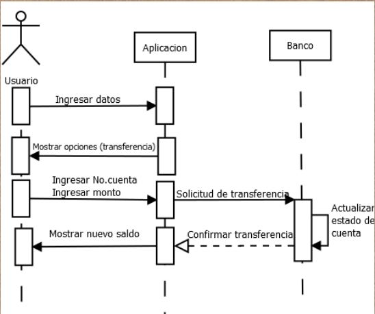
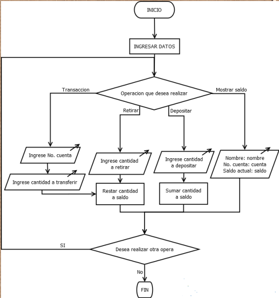

# Sistema de Banco

## Descripción

El sistema de banco es un programa que simula las operaciones de un banco. El usuario puede realizar operaciones como transferir, depositar, retirar y mostrar su saldo. Además, el sistema permite registrar usuarios e iniciar sesión.

El objetivo de esta práctica es implementar un sistema de banco utilizando el lenguaje de programación Python y el paradigma de orientación a objetos, aplicando los conceptos de programación orientada a objetos vistos en clase.

## Requerimientos

-   Hecho en el lenguaje de programación Python

-   Utilizar el paradigma de programación orientada a objetos

-   Contar con las siguientes operaciones:
    -   Transferir
    -   Depositar
    -   Retirar
    -   Mostrar saldo
    -   Registrar usuario
    -   Iniciar sesión

## Diagrama de secuencia

## Diagrama de flujo

