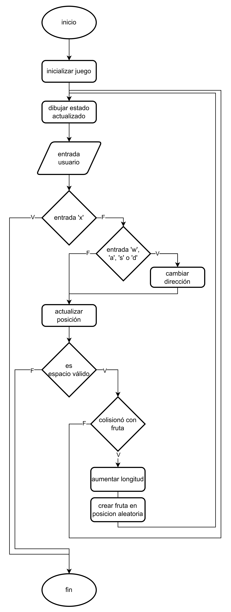

# Snake

## Descripción

El juego de la serpiente es un juego en el que el jugador controla una serpiente que se mueve por la pantalla. La serpiente crece cada vez que come una fruta y el objetivo es comer la mayor cantidad de frutas posible sin chocar con las paredes o con la serpiente misma.

El objetivo de esta práctica es implementar el juego de Snake utilizando lenguaje C con ayuda de la librería de gráficos raylib, aplicando los <a href="/Practicas/Snake/ReporteConceptosFundamentales.md">conceptos de programación fundamentales vistos en clase</a>.

## Requerimientos

-   No variables globales
-   Uso de memoria dinámica
-   No números mágicos
-   No código espagueti (no usar etiquetas)
-   Interfaz amigable

## Diagrama de flujo

## Controles

### Menu

-   **W:** Moverse hacia arriba
-   **S:** Moverse hacia abajo
-   **Enter:** Seleccionar

### Juego

-   **W:** Moverse hacia arriba
-   **A:** Moverse hacia la izquierda
-   **S:** Moverse hacia abajo
-   **D:** Moverse hacia la derecha
-   **X:** Pausar
