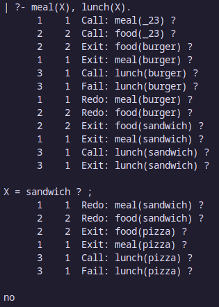
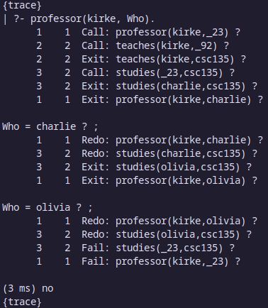

# Ejemplos de Prolog

-   **Clase:** Paradigmas de Programación
-   **Alumno:** Fernando Haro Calvo

## Ejemplo 1

```prolog
% Hechos
food(burger).
food(sandwich).
food(pizza).
lunch(sandwich).
dinner(pizza).

% Reglas
meal(X) :- food(X).
```

### Consultas

```prolog
?- food(pizza).
```

Devuelve `true.`, ya que food(pizza) es un hecho que fue declarado.

```prolog
?- meal(X), lunch(X).
```

Devuelve `X = sandwich.`, ya es el único átomo que cumple con las dos condiciones de la consulta. Prolog llega a esta conclusión comparando uno por uno los hechos y reglas con la consulta.

> 

```prolog
?- dinner(sandwich).
```

Devuelve `false.`, ya que no existe un hecho que cumpla con la consulta.

## Ejemplo 2

```prolog
% Hechos
studies(charlie, csc135).
studies(olivia, csc135).
studies(jack, csc131).
studies(arthur, cs134).
teaches(kirke, csc135).
teaches(collins, csc131).
teaches(collins, csc171).
teaches(juniper, csc134).

% Reglas
professor(X, Y) :- teaches(X, C), studies(Y, C).
```

### Consultas

```prolog
?- studies(charlie, What).
```

Devuelve `What = csc135.`, ya que solo hay un hecho que cumple con la consulta.

```prolog
?- professor(kirke, Who).
```

Primero, devolverá `Who = charlie.`, ya que charlie estudia csc135 y kirke enseña csc135. Luego, si continuamos con la consulta devolverá también `Who = olivia.`, ya que olivia también estudia csc135. El camino que sigue Prolog para llegar a estas conclusiones es el siguiente:

> 
